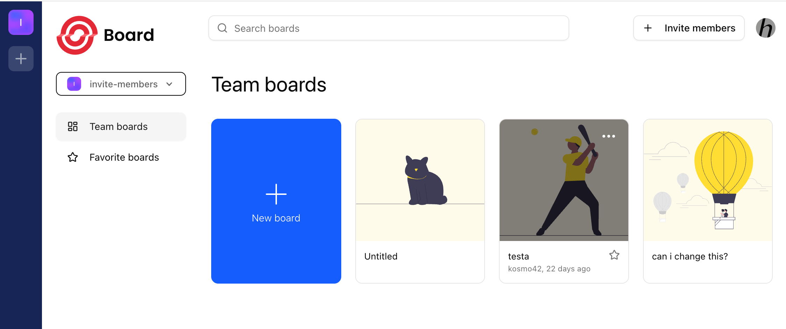
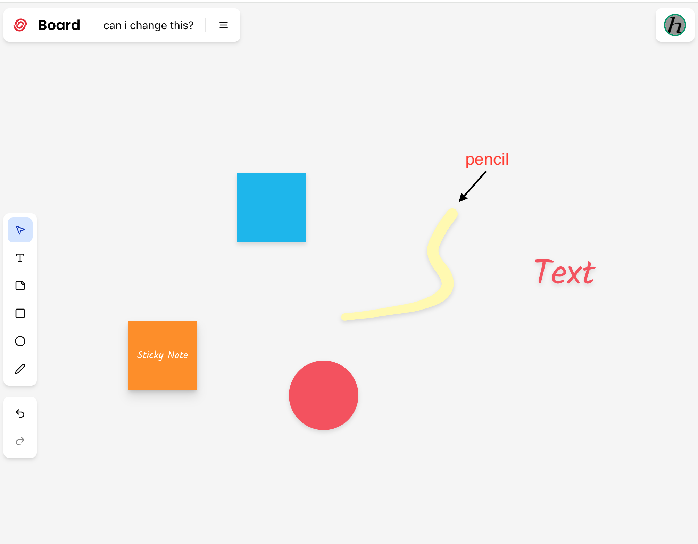
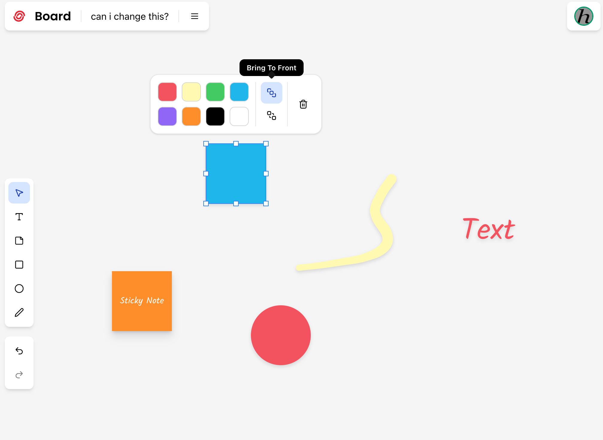
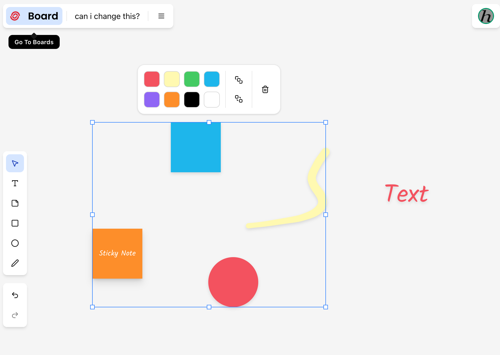
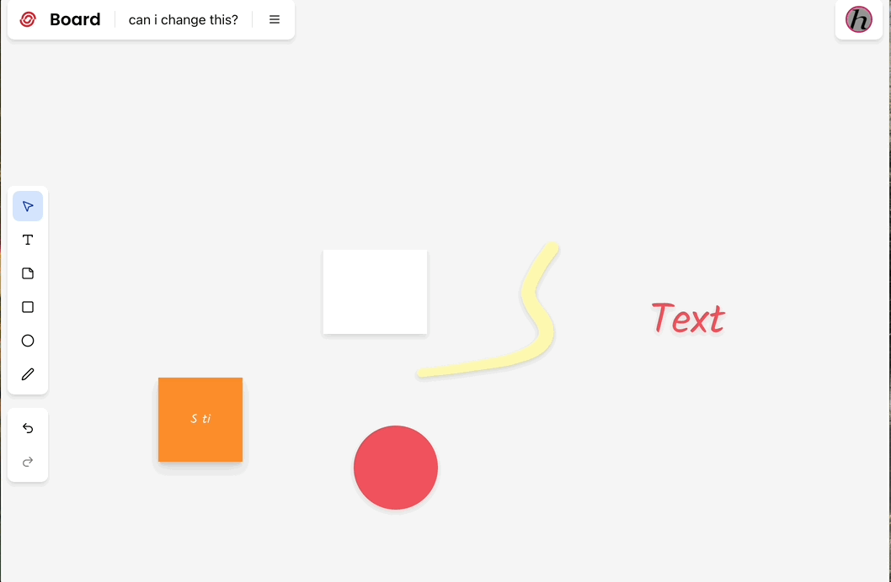
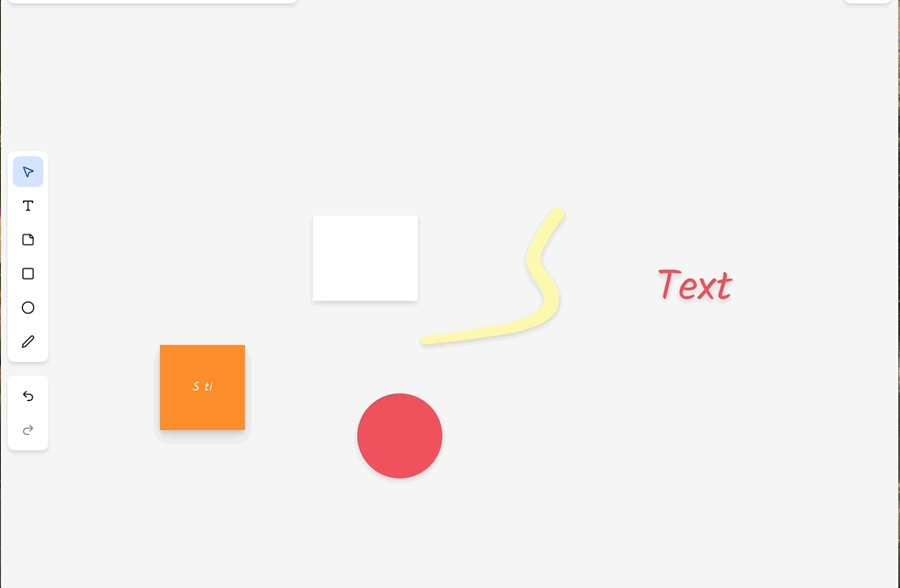
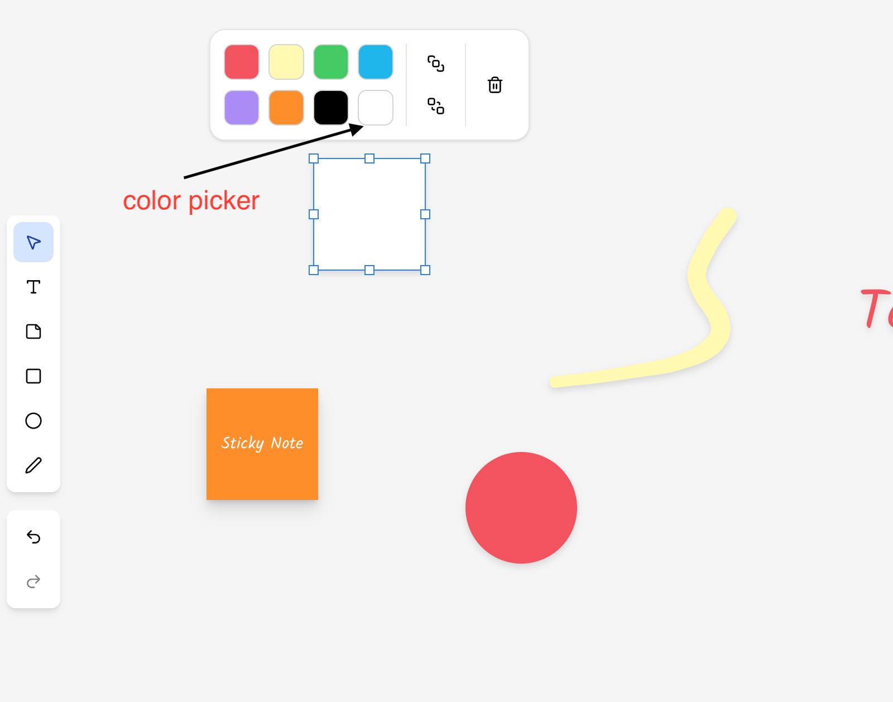
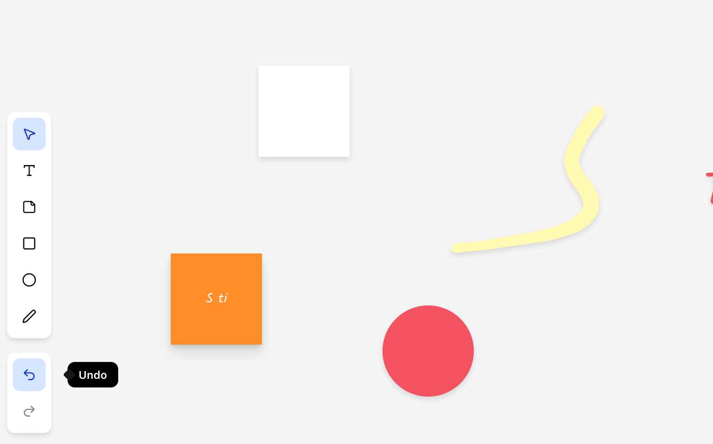
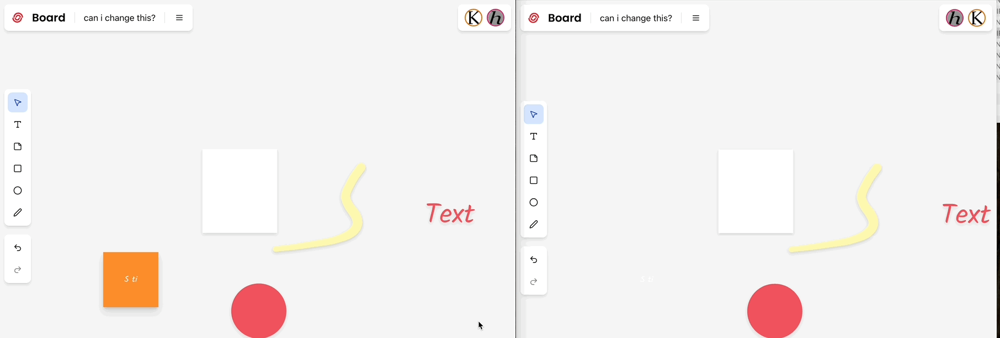
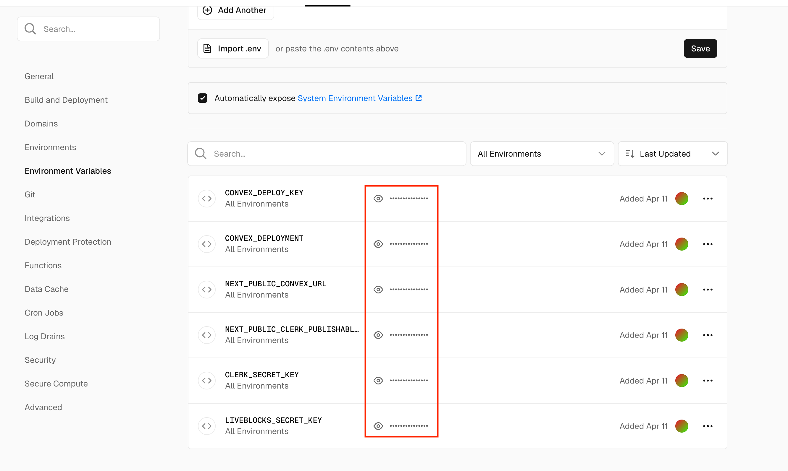

# Miro

本项目是 [miro](https://miro.com/) 的简单版本，只包含了画板核心功能的实现。项目使用 vercel 部署，点击访问
[主页](https://miro-sable.vercel.app/)。

## 主要功能

**组织与看板管理**

用户可以切换所在的组织，可以创建组织和邀请其他用户加入组织。当前组织下会有组织看板（Team boards）和收藏看板（Favorite boards）。


看板页面以卡片列表形式展示其中包含的看板，可以创建或者修改当前的看板，点击其中某个看板卡片可以跳转到该看板的详情页面。

**绘画功能**

看板包含基础的绘图功能，支持文字、签便笺、矩形、圆形和铅笔等功能。



**单选和多选**

点击形状可以选中单个图形



点击并拖动可以框选多个图形



**拖动**

鼠标点击并拖动可以移动图形位置。



**调整大小**

鼠标点击图形后出现尺寸调整方框，点击并拖动方框调整图形大小。



**🪄 分层功能**

Bring To Front / Send To Back 可以调整图形的前后顺序


**🎨 着色系统**

使用选中工具中色板可以设置选中图形颜色。



**↩️ 撤消和恢复功能**

页面左下方有撤销和恢复按钮，支持适用 ⌨️ 键盘快捷键进行操作，ctrl+z 键撤，ctrl+shift+z 恢复。



**🤝 实时协作**

同一个看板支持多个用户同时打开，实时协作编辑，页面右上角显示当前打开该看板的用户。用户的操作会在其他用户的页面实时显示。



## 本地开发

本项目使用如下技术

- 🌐 Next.js 15 框架
- 💅 TailwindCSS & ShadcnUI 造型
- [Clerk](https://dashboard.clerk.com/apps/app_2uz7PdaeImwSRqMwQ1Y7ESBaHet/instances/ins_2uz7PYeyCkToGEHShrfHBpR5ZCV/jwt-templates/jtmp_2uz8pRUjYaBj3U2yyY5KJ3bsech) 用户验证和授权
- [convex](https://dashboard.convex.dev/t/mark-zhang) 后端服务
- [liveblocks](https://liveblocks.io/) 在线协同编辑

本地开发需要首先配置本地文件`.env.local`，包含授权、后端服务和实时协作等功能依赖的 key，具体的 key 可以在 clerk、convex、liveblocks 站点用户项目的页面中查看。

```env
# Deployment used by `npx convex dev`
CONVEX_DEPLOYMENT=dev:wary-lemming-***
NEXT_PUBLIC_CONVEX_URL=https://wary-lemming-***.convex.cloud

# clerk
NEXT_PUBLIC_CLERK_PUBLISHABLE_KEY=pk_test_**
CLERK_SECRET_KEY=sk_test_***

# liveblocks
LIVEBLOCKS_SECRET_KEY=sk_dev_***
```

配置完成后本地启动页面服务器和后端服务器即可查看效果。

```bash
# 启动页面服务器
pnpm run dev

# 启动后端服务
pnpm run server
```

## 部署

在线部署使用 vercel，在线部署时需要使用生产环境专用 key，避免和开发环境混淆。本项目部署域名 https://miro-sable.vercel.app/。


